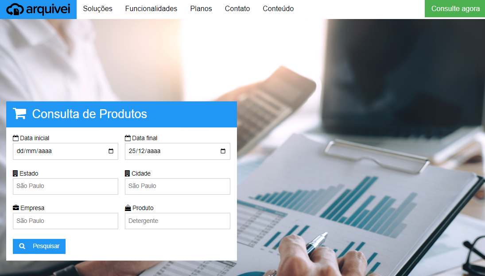

# Hackathon-Semcomp
Esse projeto foi desenvolvido durante o Hackathon da Semcomp organizado pela USP em parceria com a Arquivei. A competição teve como tema criar uma solução que permitisse extrair inteligência de notas fiscais e para isso criamos uma página de consulta que foi integrada a um pequeno banco de dados com informações sobre notas fiscais. A solução tinha como possibilidade o monitoramento dos produtos mais vendidos em determinada região (Estado/cidade) em certa época do ano, bem como os fornecedores disponíveis.

Link: https://hackathon-semcomp.up.railway.app/
